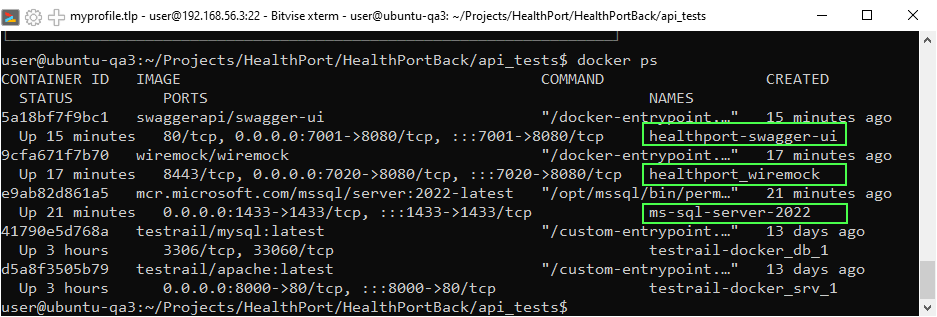
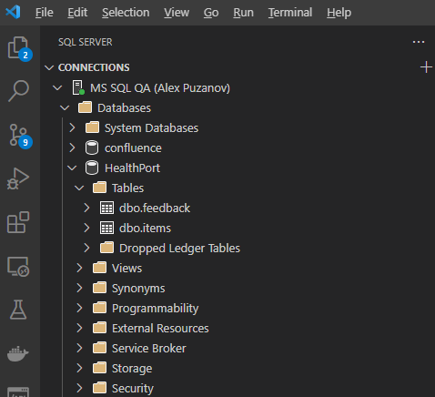
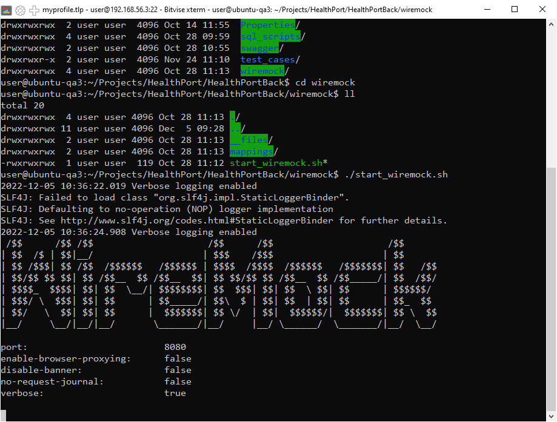
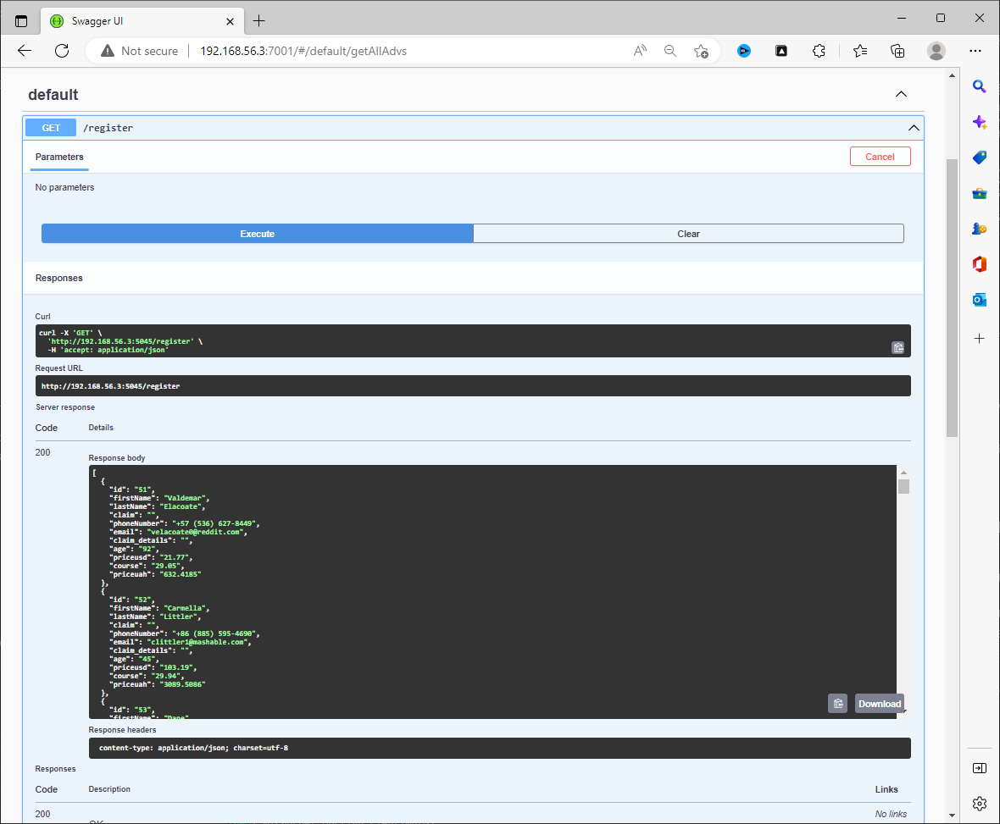
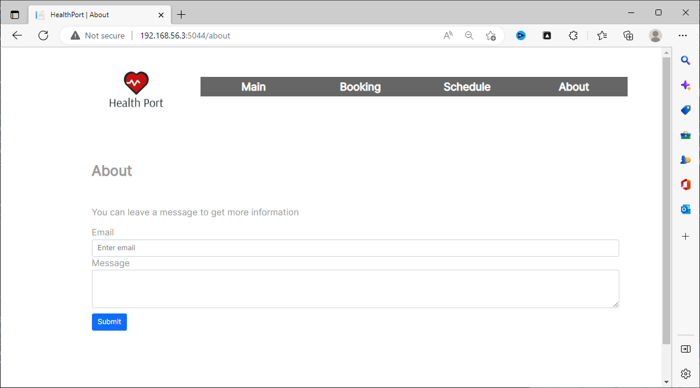
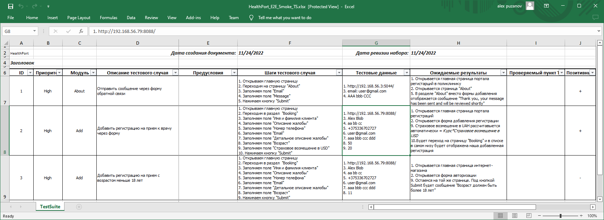
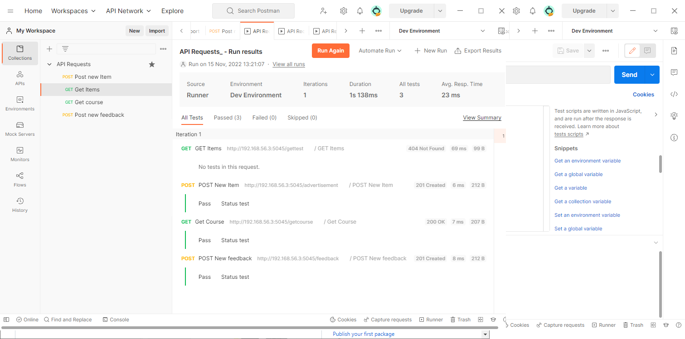
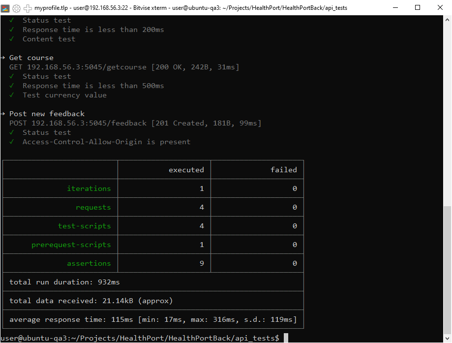
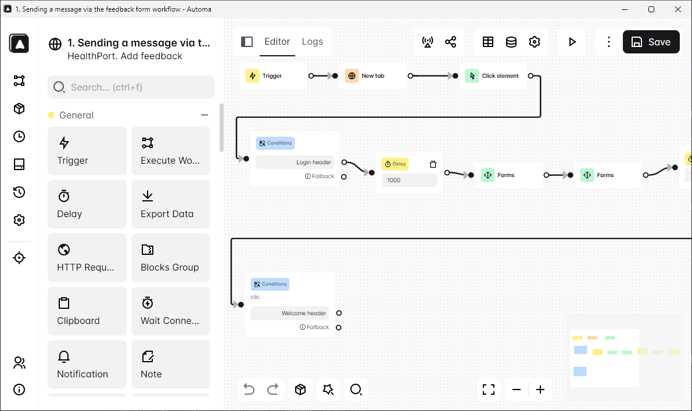
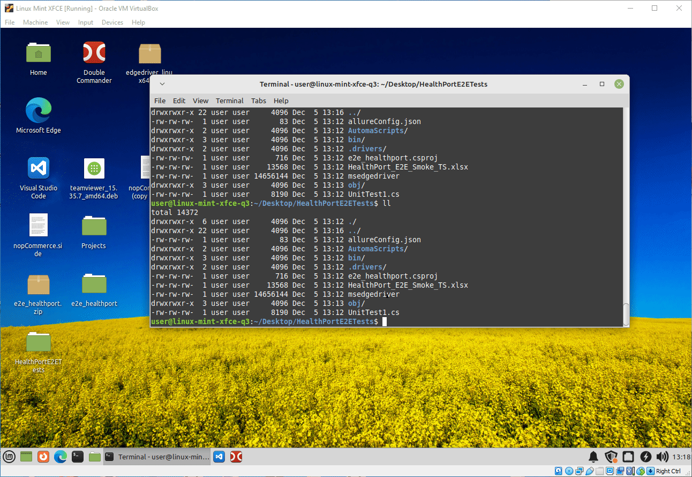

# Healthport

HealthPort is a test project for developing test automation scripts on C# and .NET

## Requirements

For raising up the project we need to have:

1. Microsoft SQL Server (2017 or higher)
2. Docker

   
3. Microsoft DOTNET6
4. Newman (for API testing)

HealthPort is cross-platform solution and can be run on Linux, MacOS, and Windows

## How to deploy the solution

### Database preparing

1. Create Database "HealthPort"
2. Execute SQL-script HealthPortBack/sql_scripts/mssqlserver/items_create_table.sql
3. Execute SQL-script HealthPortBack/sql_scripts/mssqlserver/dbo.items.sql

   

   Mocking

As a mock system we use Wiremock
For running Wiremock:
Go to HealthPortBack/wiremock and run start_wiremock.sh

### API Documentation

As an API Doc server, we use Swagger
For running Swagger:
Go to HealthPortBack/swagger and run start_swagger.sh

## How to run the solution

### Running Back API Server

Set MS SQL Server parameters in database_configuration.json
You can keep parameters in database_sqlite3_configuration.json as is
Set Wiremock parameters in external_services.json

Go to HealthPortBack and execute:
dotnet run -project ./HealthPortBack/HealthPortBack.csproj --urls http://0.0.0.0:5045
Or
You can run the solution in VSCode via a Terminal task "Run Back"

### Running Front

Set a Back API Server address in HealthPortFront/wwwroot/appsettings.json

Go to HealthPortFront and execute:
dotnet run -project ./HealthPortFront/HealthPortFront.csproj --urls http://0.0.0.0:5044
Or
You can run the solution in VSCode via a Terminal task "Run Front"

## Testing

The project has Smoke tests in the MS Excel file HealthPort_E2E_Smoke_TS.xlsx inside the solution

### API testing Postman/Newman

API tests for Postman are contained in api_tests directory
Before running set environment parameters in "Dev Environment.postman_environment.json"
You can run a collection via Postman

Or
You can run it via Newman with helps a script run_newman_test.sh in api_tests directory

### GUI testing Automa

Automa tests are contained in HealthPortE2ETests/AutomaScripts

### GUI testing Selenium

For running Selenium tests

Set up edgedriver on your system (or driver for any of your favorite browser) in ".driver" directory
Modify UnitTest1.cs for your Front-server address (and your driver if you've changed)
Run GUI/Selenium tests via command:
dotnet test

